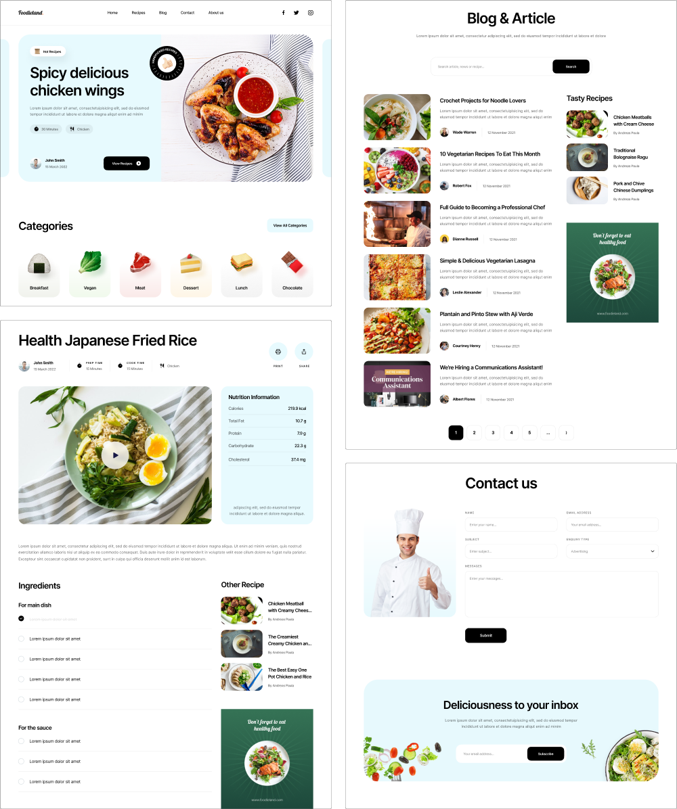

# Foodieland

Responsive multi-page food recipe website built with Minista and Vite using JSX (without React), SCSS, and a modular frontend architecture.

## Preview

## Tech Stack

- Minista (JSX without React)
- Vite
- JavaScript (ES Modules)
- SCSS
- PostCSS (preset-env, pxtorem)
- CSS Normalize

## Features

- Multi-page architecture
- JSX templating without React
- Modular component structure
- SCSS architecture with helpers and mixins
- Responsive layout
- Modern tooling with ESLint, Stylelint and Prettier
